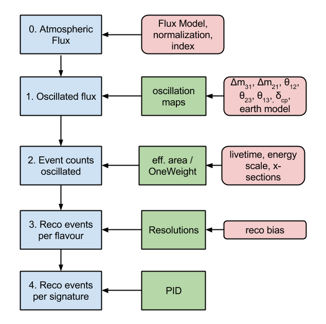

pisa
====

The common PINGU simulation and analysis code for the neutrino mass hierarchy.

## Simulation chain



The original drawing is [here](https://docs.google.com/drawings/edit?id=1RxQj8rPndwFygxw3BUf4bx5B35GAMk0Gsos_BiJIN34).

## Installation
### Requirements

To install this package, you'll need to have the following requirements
installed

* [pip](https://pip.pypa.io/) -- version > 1.2 recommended
* [swig](http://www.swig.org/) -- install with `--universal` option
* [numpy](http://www.numpy.org/)
* [scipy](http://www.scipy.org/)
* [hdf5](http://www.hdfgroup.org/HDF5/) -- install with `--enable-cxx` option
* [h5py](http://www.h5py.org/) -- install via pip

If you are working on OSX, we suggest [homebrew](brew.sh/) as a package manager, which supports all of the non-python packages above. 

### Obtaining `pisa`
You can directly install via `pip` from github, using the following commands
```
pip install [ --src <your/source/dir> --editable ] git+https://github.com/sboeser/pisa@<branch>#egg=pisa 
cd <your/source/dir>/pisa && git checkout <branch>
```

where

* `<branch>` is the branch you'd like to install. This could be either one of
  the releases, or `master`
* `--editable` tells `pip` to make an editable installation, i.e instead of
  installing directories in your `<site-packages>` directory, `pip` will install
  the source in `<your/source/dir>` and link this from the `<site-packages>`.
  This way, if you change the source the changes will be automatically reflected
  when you run the code. __NOTE__: a subdirectory `pisa` that holds your files will be created within `<your/source/dir>`.
* As for now (`pip <= 1.5.6`) the additional `git checkout <branch>` is required as `pip`
  will checkout the specific latest commit in the branch you give, rather than
  the `HEAD` of that branch. You are thus left with a _detached HEAD_, and can
  not commit to the branch you check out.
  
__Notes:__

* You can work with your installation using the usual git commands (pull,
push, etc.). Note however, that these won't rebuild any of the extension (i.e.
_C/C++_) libraries. If you want to recompile these libraries, simply run
<br>```cd <your/source/dir>/pisa && python setup.py build_ext```

* If you did not install `pisa` in a virtual environment, then the package will
  be installed alongside with your other python packages. This typically means
  that you'll need super-user priviledges to install, i.e.<br>
  ```sudo pip install ...```<br>
  If your are using above with the `--editable` option, the source files will
  also be installed by the super-user, which means you might not be able to edit
  them. In this case, just<br>
  ```cd <your/source/dir> && sudo chown -R <user> pisa```<br>
  where `<user>` obviously just is your user name.

## Data formats

This [working document](https://docs.google.com/document/d/1qPVrtECZUDHVVJz_CncCemqmeHk5nOgPlceIU7-jNGc/edit#) describes some of the data formats that will be used in the different steps.
